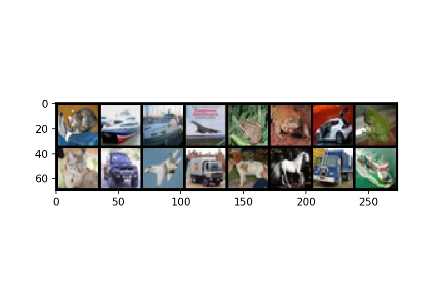
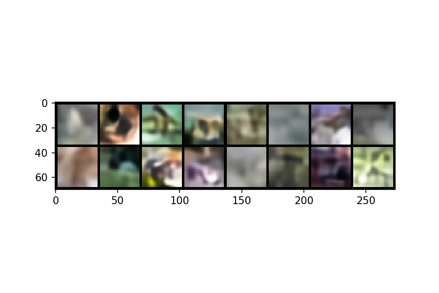
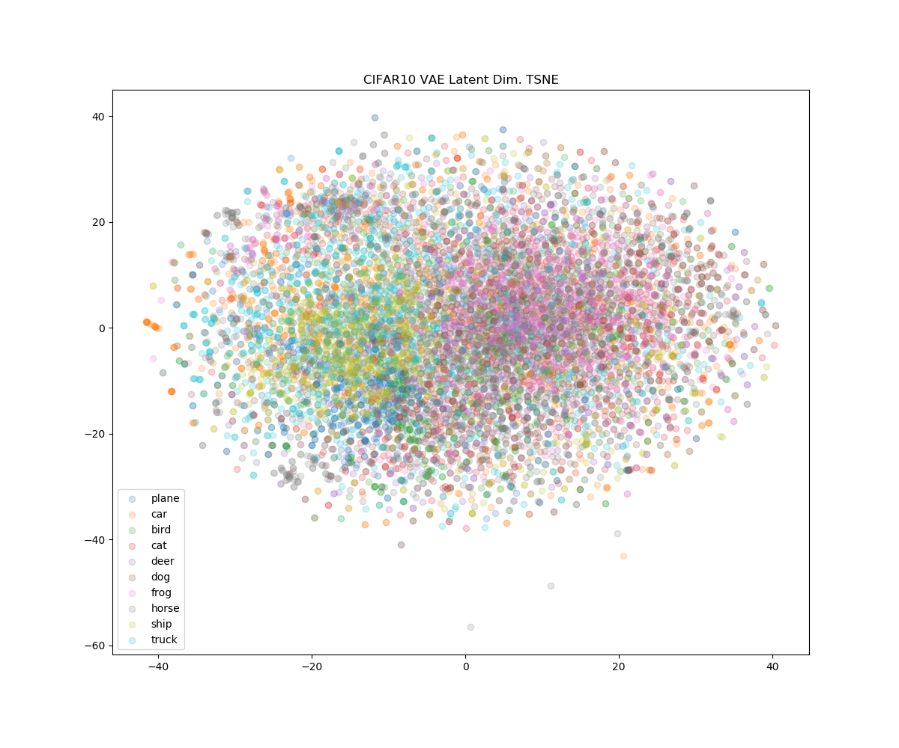

# VAE

```bash
# train vae
python vae/vae.py --prior normal --posterior normal

# finetune vae
python vae/finetune.py path/to/checkpoint

# measure gini sparsity
python vae/gini_sparsity.py path/to/checkpoint
```

 * `vae/vae.py` - VAE python module
 * `vae/finetune.py` - Fintune python module
 * `vae/resnet.py` - ResNet based encoder and decoder architecture

## Results

Model     | Prior (P) | Posterior (Q) | Reconstruct View | Val. Gini | Finetune Val. Acc. 
---       | ---       | ---           | ---              | ---       | ---
ResNet18  | Normal    | Normal        | None             | 0.431     | 41.67
ResNet18  | Laplace   | Normal        | None             | 0.449     | 40.91
ResNet18  | Normal    | Laplace       | None             | 0.454     | 41.67
ResNet18  | Normal    | Normal        | SimCLR           |           |
ResNet18  | Laplace   | Normal        | SimCLR           |           |
ResNet18  | Normal    | Laplace       | SimCLR           |           |

## ResNet VAE Architecture

#### Encoder

Encoder is standard ResNet18 architecture, but `conv1` is places with a 3x3
kernel with stride 1, padding 1. The output of the final average pool is
512x1x1.

#### Decoder

Decoder is essentially the encoder in reverse order, where the average pool is
replaced with a linear layer, and stride 2 convolutions are replaced with a 2x
upscale followed by a stride 1 convolution.

## Pre-train Results

#### Input and Reconstruction




#### Random Sample




#### TSNE


